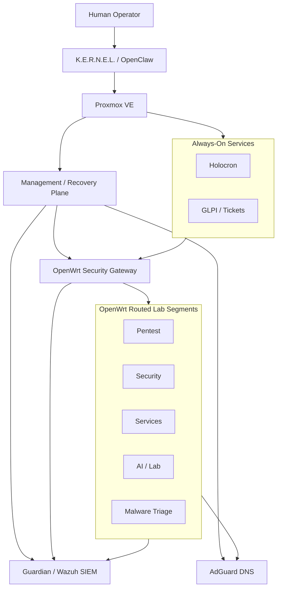

<div align="center">

# VaughnLab

### AI-assisted infrastructure • defensive security • segmented homelab engineering

**A private Proxmox-based research environment built around recoverable operations, least privilege, observability, and security-first automation.**

<p>
  
  
  
  
</p>

<p>
  
  
  
  
  
</p>

[Architecture](docs/architecture.md) • [Inventory](docs/inventory.md) • [Security Model](docs/security-model.md) • [Roadmap](docs/roadmap.md) • [WARPi](docs/runbooks/warpi-remote-ops.md) • [Security Policy](SECURITY.md)

</div>

---

## Overview

**VaughnLab** is a personal AI, cybersecurity, and infrastructure engineering lab. It is designed as a place to build real systems, break controlled systems, automate repetitive operations, test security ideas, and learn from failures without treating the environment like a disposable demo.

The lab combines virtualization, routed security zones, controlled DNS, centralized defensive monitoring, remote-access tooling, dedicated offensive-security systems, and AI-assisted operations. Public documentation focuses on architecture, engineering decisions, operating patterns, and recovery design while deliberately excluding credentials and rebuild-sensitive access details.

At the center of the operational model is **K.E.R.N.E.L.** — **Knowledge Engine for Reasoning, Engineering, Networking, Execution, and Learning** — an AI-assisted operations layer that maintains documentation, inspects approved systems, coordinates workflows, and performs authorized engineering work through constrained identities and documented boundaries.

---

## Platform Stack

| Layer | Technology | Role |
|---|---|---|
| **Virtualization** | Proxmox VE | Compute, VM/CT lifecycle, snapshots, storage and virtual networking |
| **Network boundary** | OpenWrt | Routed lab segmentation, DHCP, firewall policy and DNS enforcement |
| **DNS security** | AdGuard Home | Controlled resolver and DNS filtering for routed workloads |
| **Defensive monitoring** | Guardian / Wazuh | SIEM, host telemetry, firewall/syslog ingestion and security detections |
| **Private access** | Tailscale | Approved remote management and private service connectivity |
| **AI operations** | OpenClaw / K.E.R.N.E.L. | Documentation, orchestration and approved infrastructure automation |
| **Offensive lab** | Kali Linux / WARPi | Isolated assessment and portable security workflows |
| **Documentation** | GitHub + Mermaid | Durable, sanitized architecture memory and diagrams |

---

## Architecture at a Glance



The management and recovery plane intentionally remains separate from routed experimental workloads. OpenWrt provides the routed boundary for VaughnLab security zones, while selected core systems remain on the management network to preserve recovery and control-plane availability.

Current lab segmentation is documented at a public-safe level using private `10.66.x.x` ranges for **pentest**, **security**, **services**, **AI/lab**, and **triage** workloads. Exact host-level addressing and rebuild-sensitive details are intentionally kept out of the public repository.

> [!IMPORTANT]
> **Guardian does not claim full packet visibility across every Proxmox bridge.** Current monitoring includes host telemetry, OpenWrt firewall/DHCP/syslog events, Proxmox telemetry, and traffic visible to the configured sensor interfaces. Full passive east/west visibility would require a dedicated mirror, TAP, or sensor design.

---

## Operating Model

### Always-On Infrastructure

These systems provide the control, networking, DNS, application, ticketing, and monitoring foundations of the lab. They are intended to return automatically after Proxmox host startup.

| System | Purpose |
|---|---|
| **openclaw01** | K.E.R.N.E.L. / OpenClaw operations control plane |
| **holocron01** | Private Holocron application platform |
| **dns01** | AdGuard DNS filtering and resolution |
| **openwrt01** | Routed lab gateway and firewall enforcement |
| **tickets01** | GLPI service-management and ticketing platform |
| **guardian01** | Wazuh-based SIEM and defensive monitoring |

### On-Demand Workloads

Experimental, resource-intensive, vulnerable, or security-focused systems remain powered off unless they are required for an approved workflow.

| System | Purpose |
|---|---|
| **mission01** | Protected mission/backend workload |
| **derp01** | DERP AI-security target and networking experiments |
| **labai01** | Local AI / LLM experimentation |
| **baydispatch01** | Workflow and dispatch automation development |
| **maltriage01** | Isolated malware-analysis and triage environment |
| **pentest01** | Kali-based penetration-testing workstation |

This power model reduces idle attack surface and resource use while keeping core operational services continuously available.

---

## Security Model

VaughnLab is intentionally designed around **segmentation, least privilege, recoverability, and observable changes** rather than assuming that a private homelab does not need security controls.

### Core principles

- **Least privilege by default** — routine automation receives only the authority required for approved lab operations.
- **Key-based administration** — supported Linux guests use a named `kernel` identity with SSH keys and approved sudo rights.
- **Break-glass recovery** — Linux root remains a local/console recovery identity rather than a routine password-SSH path.
- **Network segmentation** — experimental and security workloads are routed through OpenWrt security zones instead of sharing a flat management network.
- **Controlled DNS** — routed lab clients use AdGuard, with direct DNS bypass blocked where policy is enforced.
- **Centralized visibility** — Guardian collects defensive telemetry and correlates meaningful infrastructure/security events.
- **Snapshots before risk** — significant infrastructure work favors recoverable checkpoints before destructive changes.
- **Public-safe documentation** — GitHub records architecture and engineering decisions without publishing operational secrets.

Read the full [security model](docs/security-model.md) for trust boundaries, approval rules, and administrative design.

---

## K.E.R.N.E.L.

> **Knowledge Engine for Reasoning, Engineering, Networking, Execution, and Learning**

K.E.R.N.E.L. is the AI-assisted operations layer for VaughnLab. It is designed to act as an engineering copilot rather than an unrestricted administrator: it reads durable documentation first, performs targeted live verification when current state matters, executes approved work through constrained identities, validates affected systems, and documents meaningful persistent changes.

The preferred routine workflow is:

```text
Existing documentation
        ↓
Targeted live verification
        ↓
Execute approved change
        ↓
Validate affected system
        ↓
Update durable documentation
        ↓
Sanitize / scan / publish
```

Protected systems and privileged host operations remain explicit authority boundaries. A failed permission check is treated as a security control functioning correctly, not as something to bypass.

---

## Guardian Defensive Monitoring

**Guardian** is VaughnLab's centralized defensive monitoring platform. It is built around Wazuh with supporting log and IDS components and receives telemetry from the systems that form the lab's security boundary.

Current monitoring capabilities include host events, OpenWrt firewall/DHCP/syslog activity, selected Proxmox lifecycle/admin telemetry, authentication events, and IDS events visible to Guardian's configured interfaces. The project deliberately documents the difference between **log visibility** and **full packet visibility** rather than overstating sensor coverage.

---

## WARPi Field Platform

**WARPi** is the portable security field platform for VaughnLab. It is designed for trusted-network operation, controlled field workflows, Tailscale-backed management where approved, health/state reporting, and security actions exposed through deliberate wrappers rather than unrestricted remote command execution.

Active security tooling belongs on WARPi, the dedicated pentest environment, or other approved security systems. General AI operations infrastructure stays focused on reasoning, orchestration, documentation, and defensive administration.

See the [WARPi remote operations runbook](docs/runbooks/warpi-remote-ops.md).

---

## Documentation Map

| Document | Description |
|---|---|
| [Architecture](docs/architecture.md) | Logical layers, networking, monitoring and system relationships |
| [Inventory](docs/inventory.md) | Sanitized roles and normal power posture |
| [Security Model](docs/security-model.md) | Trust boundaries, identities, approvals and safety controls |
| [Audit Findings](docs/audit-findings.md) | Public-safe security/audit snapshot |
| [Roadmap](docs/roadmap.md) | Completed milestones and future priorities |
| [WARPi Runbook](docs/runbooks/warpi-remote-ops.md) | Approved field-device operations model |
| [Security Policy](SECURITY.md) | Public repository scope and responsible disclosure |
| [Architecture Diagram](docs/diagrams/architecture.mmd) | Maintainable Mermaid architecture source |

---

## Repository Layout

```text
Vaughn_HOMELAB/
├── README.md
├── SECURITY.md
└── docs/
    ├── architecture.md
    ├── inventory.md
    ├── security-model.md
    ├── audit-findings.md
    ├── roadmap.md
    ├── diagrams/
    │   └── architecture.mmd
    └── runbooks/
        └── warpi-remote-ops.md
```

---

## Public Repository Boundary

This repository is intentionally sanitized. It is intended to show **how the lab is engineered**, not provide a rebuild guide containing live access material.

The public repository does **not** intentionally publish:

- Passwords, API tokens, private keys or authentication secrets
- Tailscale auth keys, live private DNS names or session details
- Customer or employer information
- Raw private-system security scan output
- Rebuild-sensitive administrative access details
- Unnecessary exact host-level addressing

High-level RFC1918 network ranges may be shown when useful for explaining architecture, but operational secrets remain in private systems and approved secret-handling workflows.

---

## Engineering Philosophy

> **Build it. Observe it. Break it safely. Recover it. Document what was learned.**

VaughnLab is an evolving engineering environment rather than a finished product. Systems are intentionally built with rollback paths, explicit trust boundaries, useful telemetry, and enough documentation that future work can start from known state instead of rediscovering the environment every time.

<div align="center">

### Built for practical infrastructure, security engineering, AI operations, and continuous learning.


</div>
