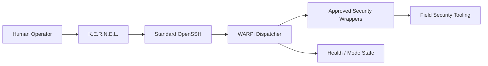

<div align="center">


# W.A.R.P.i.

### Wireless Assessment & Reconnaissance Platform (Pi)

**Portable field operations for controlled wireless assessment, reconnaissance, telemetry, and security workflows.**

<p>
  
  
  
</p>

[Remote Operations Runbook](runbooks/warpi-remote-ops.md) • [Security Model](security-model.md) • [VaughnLab Architecture](architecture.md)

</div>

---

## What WARPi Is

**WARPi** is VaughnLab's portable security field platform. It is designed to move active assessment work away from the general AI/orchestration control plane and onto a purpose-built Raspberry Pi system with deliberate operating modes, constrained remote-control paths, and auditable wrappers for approved security activity.

The platform is intended for trusted, authorized environments and lab exercises. K.E.R.N.E.L. can coordinate approved WARPi workflows, inspect health/state, and use documented wrappers, while raw security tooling remains on the field platform rather than being added to the OpenClaw control host.

---

## Design Goals

| Goal | Design intent |
|---|---|
| **Portable** | Small Raspberry Pi-based platform suitable for field and lab use |
| **Controlled** | Security actions exposed through approved wrappers instead of unrestricted remote commands |
| **Observable** | Health, state, and documentation checks can be returned in structured form |
| **Recoverable** | Mode changes are planned and validated rather than treated as ad-hoc shell sequences |
| **Private** | Remote administration uses approved private-management paths rather than public exposure |
| **Documented** | Persistent behavior and operating rules live in durable VaughnLab documentation |

---

## Operating Model



K.E.R.N.E.L. is the coordinator, not the offensive tool host. The control path is intentionally narrow: standard SSH, known commands, approved targets, validation, and explicit operator approval for changes to WARPi itself.

---

## Mode-Aware Operations

WARPi development includes a mode dispatcher that separates **planning** from disruptive field-state changes. The current validated dispatcher includes dry-run planning paths for entering field mode and returning to normal operation.

```text
warpi mode enter-field
        ↓
Dry-run / plan
        ↓
Validate expected state
        ↓
Approved transition

warpi mode return-normal
        ↓
Dry-run / plan
        ↓
Validate expected state
        ↓
Approved transition
```

The dispatcher is designed to fail safely when the expected runtime state is unavailable rather than inventing state or blindly applying network changes.

---

## Approved Remote Operations

WARPi remote operations use **standard OpenSSH** plus documented K.E.R.N.E.L. wrappers.

### Platform status

```bash
kernel-report --json
```

Returns the platform's structured health/state report for approved remote inspection.

### Documentation audit

```bash
kernel-doc-audit --json
```

Checks documented WARPi state and helps detect drift between expected and implemented behavior.

### Approved security activity

```bash
kernel-security <approved-command> <target>
```

The wrapper is the policy boundary for approved assessment actions. If a target is rejected, the workflow stops and requires explicit target approval instead of bypassing the guardrail.

---

## Security Boundaries

WARPi follows a simple rule: **put active security tooling on the security platform, and keep the general AI control plane focused on reasoning and orchestration.**

- Standard OpenSSH is the supported remote shell path.
- Tailscale SSH is not the WARPi administration model.
- Security scans do not require granting broad sudo access to the AI control plane.
- When an approved `kernel-security` wrapper exists, K.E.R.N.E.L. should use it instead of inventing raw tool commands.
- WARPi itself is not modified without explicit approval.
- Rejected or unapproved targets are a hard stop.
- Secrets, private keys, live credentials, and rebuild-sensitive access details are not published in this repository.

---

## Development Discipline

WARPi is being developed as a set of bounded, testable milestones rather than as one giant autonomous build. Changes favor:

1. Existing documentation and source as the starting point.
2. Small, targeted edits.
3. Dry-run behavior before disruptive operations.
4. Syntax/static validation after code changes.
5. Targeted functional and regression testing.
6. Git diff review before publishing.
7. A clean checkpoint before moving to the next milestone.

This model is especially important for network-mode transitions, where a malformed change can strand remote access or create unintended routing behavior.

---

## Current Public-Safe Status

The public repository intentionally describes WARPi at the architecture and operations level rather than exposing live field configuration. Current documented work includes:

- Standard OpenSSH remote-operations model
- Structured health/state reporting
- Documentation drift auditing
- Approved security-command wrappers
- Target approval enforcement
- Mode dispatcher work for `enter-field` and `return-normal`
- Dry-run planning and regression validation for mode transitions

Exact interface names, live wireless configuration, credentials, private addresses, and assessment targets remain outside the public repository.

---

## Related Documentation

| Document | Purpose |
|---|---|
| [WARPi Remote Operations](runbooks/warpi-remote-ops.md) | Operator-facing command and safety rules |
| [Security Model](security-model.md) | VaughnLab trust boundaries and approval model |
| [Architecture](architecture.md) | Where WARPi fits into the wider lab |
| [Roadmap](roadmap.md) | Current documentation and platform priorities |

---

<div align="center">

### FIELD OPERATIONS • CONTROLLED EXECUTION • RECOVERABLE CHANGES

**WARPi keeps the security tools where they belong: on the field platform, behind explicit guardrails.**

</div>
